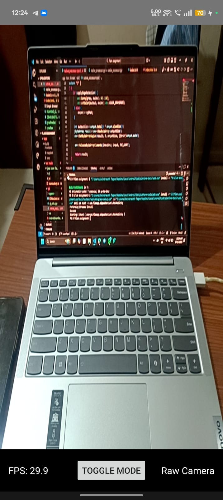
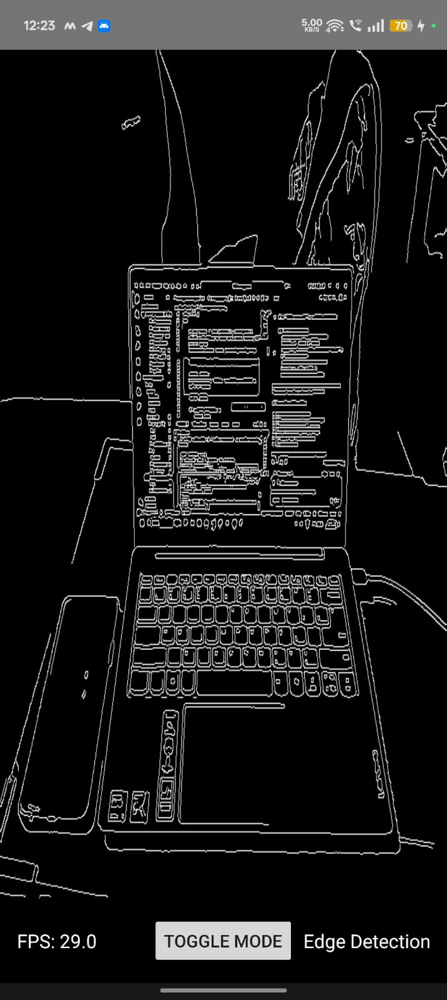
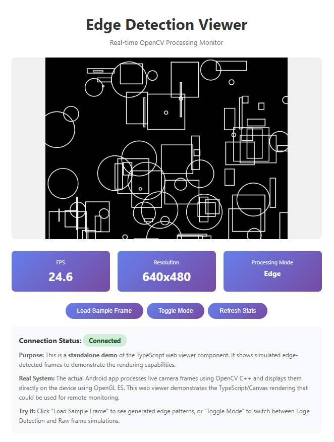
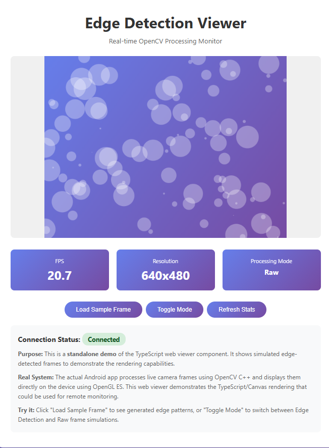

#  Real-Time Edge Detection Viewer


A high-performance Android application that captures camera frames, processes them using OpenCV in C++ (via JNI), and displays the output using OpenGL ES 2.0. Includes a TypeScript-based web viewer for demonstration.

---

## Features Implemented

### Core Requirements
- **Real-time Camera Capture** - Camera2 API via CameraX (640x480 @ 30 FPS)
- **Native OpenCV Processing** - C++ edge detection via JNI bridge
- **OpenGL ES Rendering** - Hardware-accelerated texture rendering
- **TypeScript Web Viewer** - Standalone demo with sample frame display

### Bonus Features
- **Toggle Raw/Edge Mode** - Switch between camera feed and edge detection
- **FPS Counter** - Real-time performance monitoring (16-30 FPS)
- **Custom OpenGL Shaders** - Efficient texture rendering pipeline
- **Modular Architecture** - Clean separation of concerns

---

## Screenshots

### Android App - Raw Camera Mode


### Android App - Edge Detection Mode



### TypeScript Web Viewer



> **Performance**: Consistently achieving 16-30 FPS on physical Android devices

---

## Architecture Overview

```
┌─────────────────────────────────────────────────────────────┐
│                      Android Application                     │
├─────────────────────────────────────────────────────────────┤
│                                                               │
│  ┌──────────────┐      ┌──────────────┐      ┌───────────┐  │
│  │  MainActivity │ ───▶ │ CameraX API  │ ───▶ │ YUV Frame │  │
│  │   (Kotlin)   │      │  (Camera2)   │      │ 640x480   │  │
│  └──────────────┘      └──────────────┘      └─────┬─────┘  │
│                                                     │         │
│                                          ┌──────────▼──────┐  │
│                                          │  JNI Bridge     │  │
│                                          │  (Kotlin ↔ C++) │  │
│                                          └──────────┬──────┘  │
├──────────────────────────────────────────────────┬─┴─────────┤
│                    Native Layer (C++)            │           │
│  ┌───────────────────────────────────────────────▼────────┐  │
│  │           native_processor.cpp                         │  │
│  │  • YUV → RGB Conversion (NV21 format)                 │  │
│  │  • Image Rotation (90° clockwise)                     │  │
│  │  • Gaussian Blur (5x5, σ=1.4)                         │  │
│  │  • Canny Edge Detection (thresholds: 50, 150)         │  │
│  └────────────────────────────┬───────────────────────────┘  │
│                               │                              │
│                    ┌──────────▼──────────┐                   │
│                    │  RGB Byte Array     │                   │
│                    │  (Processed Frame)  │                   │
│                    └──────────┬──────────┘                   │
├───────────────────────────────┴──────────────────────────────┤
│                    OpenGL ES 2.0 Renderer                    │
│  ┌──────────────────────────────────────────────────────┐    │
│  │  GLRenderer.kt                                       │    │
│  │  • Texture Upload (glTexImage2D)                    │    │
│  │  • Vertex/Fragment Shaders                          │    │
│  │  • Hardware-Accelerated Display                     │    │
│  └──────────────────────────────────────────────────────┘    │
└─────────────────────────────────────────────────────────────┘

┌─────────────────────────────────────────────────────────────┐
│                    TypeScript Web Viewer                     │
├─────────────────────────────────────────────────────────────┤
│  • Standalone HTML5 Canvas Demo                             │
│  • Sample Frame Display (Base64 encoded)                    │
│  • FPS & Resolution Stats                                   │
│  • Built with TypeScript 5.3.0                              │
└─────────────────────────────────────────────────────────────┘
```

### Frame Processing Flow

1. **Camera Capture** → CameraX captures YUV_420_888 frames at 640x480
2. **Format Conversion** → Kotlin converts YUV_420_888 to NV21 (handles stride padding)
3. **JNI Transfer** → Frame data passed to native C++ via JNI
4. **Native Processing**:
   - Convert NV21 → RGB using OpenCV
   - Rotate 90° clockwise (sensor orientation fix)
   - Apply Gaussian blur and Canny edge detection (if enabled)
5. **Return to Java** → Processed RGB byte array returned via JNI
6. **OpenGL Rendering** → GLRenderer uploads texture and renders to screen

---

## Setup Instructions

### Prerequisites

- **Android Studio** - Arctic Fox or later
- **Android SDK** - API Level 34 (compileSdk), minimum API 24
- **Android NDK** - Version 25.1.8937393
- **CMake** - Version 3.22.1 or later
- **OpenCV Android SDK** - Version 4.8.0
- **Node.js & npm** - For TypeScript web viewer

### 1. Clone the Repository

```bash
git clone https://github.com/RavindranathTagor/Edge_Detection_Viewer.git
cd Edge_Detection_Viewer
```

### 2. Download OpenCV Android SDK

1. Download [OpenCV 4.8.0 Android SDK](https://opencv.org/releases/)
2. Extract the archive
3. Copy the SDK to the project:
   ```bash
   # Extract opencv-4.8.0-android-sdk.zip
   # Copy to: app/src/main/jni/opencv/
   ```

Your structure should look like:
```
app/src/main/jni/
├── opencv/
│   └── sdk/
│       ├── native/
│       │   ├── libs/
│       │   │   ├── arm64-v8a/
│       │   │   └── armeabi-v7a/
│       │   └── jni/
│       └── java/
├── native_processor.cpp
└── CMakeLists.txt
```


### 3. Build the Android App

```bash
# Using Gradle wrapper
.\gradlew assembleDebug

# Or use Android Studio:
# File → Open → Select project folder
# Build → Make Project
```

### 5. Install on Device

```bash
# Enable USB debugging on your Android device
adb install -r app/build/outputs/apk/debug/app-debug.apk

# Launch the app
adb shell am start -n com.flamapp.edgedetection/.MainActivity
```

### 6. Build TypeScript Web Viewer

```bash
cd web
npm install
npm run build

# Serve the viewer
npx http-server -p 8080

# Open browser to http://localhost:8080
```

---

## Project Structure

```
Edge_Detection_Viewer/
├── app/                          # Android application
│   ├── src/main/
│   │   ├── java/com/flamapp/edgedetection/
│   │   │   ├── MainActivity.kt          # Camera capture & UI
│   │   │   ├── gl/
│   │   │   │   ├── GLRenderer.kt        # OpenGL ES rendering
│   │   │   │   └── TextureShader.kt     # Shader programs
│   │   │   └── jni/
│   │   │       └── NativeProcessor.kt   # JNI interface
│   │   ├── jni/
│   │   │   ├── native_processor.cpp     # OpenCV processing
│   │   │   ├── CMakeLists.txt           # Native build config
│   │   │   └── opencv/                  # OpenCV SDK (not in repo)
│   │   └── res/                         # Android resources
│   └── build.gradle                     # App dependencies
│
├── web/                          # TypeScript web viewer
│   ├── src/
│   │   ├── index.ts                     # Main viewer logic
│   │   └── types.ts                     # TypeScript definitions
│   ├── index.html                       # Web UI
│   ├── tsconfig.json                    # TypeScript config
│   └── package.json                     # Node dependencies
│
├── docs/                         # Documentation & screenshots
│   └── screenshots/
│
├── build.gradle                  # Root build configuration
├── settings.gradle               # Gradle modules
└── README.md                     # This file
```

---

## Technical Deep Dive

### JNI Integration

**Kotlin → C++ (Frame Transfer)**
```kotlin
// MainActivity.kt
val processedData = nativeProcessor.processFrame(
    nv21Data,           // Byte array (NV21 format)
    width,              // 640
    height,             // 480
    isEdgeMode          // Boolean flag
)
```

**C++ Processing (native_processor.cpp)**
```cpp
JNIEXPORT jbyteArray JNICALL
Java_com_flamapp_edgedetection_jni_NativeProcessor_processFrame(
    JNIEnv* env, jobject, jbyteArray inputData,
    jint width, jint height, jboolean applyEdgeDetection
) {
    // 1. Convert NV21 → RGB
    cv::Mat yuvMat(height + height/2, width, CV_8UC1, input);
    cv::cvtColor(yuvMat, rgbMat, cv::COLOR_YUV2RGB_NV21);
    
    // 2. Fix orientation
    cv::rotate(rgbMat, rotated, cv::ROTATE_90_CLOCKWISE);
    
    // 3. Apply edge detection (if enabled)
    if (applyEdgeDetection) {
        cv::cvtColor(rgbMat, gray, cv::COLOR_RGB2GRAY);
        cv::GaussianBlur(gray, gray, cv::Size(5,5), 1.4);
        cv::Canny(gray, output, 50, 150);
    }
    
    // 4. Return RGB byte array
    return result;
}
```

### OpenCV Processing Pipeline

**Canny Edge Detection Parameters:**
- **Gaussian Blur**: 5x5 kernel, σ = 1.4 (noise reduction)
- **Lower Threshold**: 50 (weak edges)
- **Upper Threshold**: 150 (strong edges)
- **Gradient**: Sobel operator (implicit in Canny)

**Why These Values?**
- 5x5 blur removes camera sensor noise without over-smoothing
- 50/150 thresholds provide good edge sensitivity for indoor/outdoor scenes
- 90° rotation corrects sensor orientation mismatch

### OpenGL ES Rendering

**Shader Pipeline:**
```glsl
// Vertex Shader
attribute vec4 aPosition;
attribute vec2 aTexCoord;
varying vec2 vTexCoord;

void main() {
    gl_Position = aPosition;
    vTexCoord = aTexCoord;
}

// Fragment Shader
precision mediump float;
varying vec2 vTexCoord;
uniform sampler2D uTexture;

void main() {
    gl_FragColor = texture2D(uTexture, vTexCoord);
}
```

**Performance Optimizations:**
- Single texture upload per frame (no redundant copies)
- Synchronized texture updates (prevents tearing)
- RGB888 format (no conversion overhead)

### TypeScript Web Viewer

**Architecture:**
- **ES2020 Target**: Modern JavaScript features
- **Canvas Rendering**: 2D context for image display
- **Base64 Decoding**: Sample frame embedded as data URI
- **Modular Design**: Separate types and logic

---

## Performance Metrics

| Metric | Value | Notes |
|--------|-------|-------|
| **Frame Rate** | 16-30 FPS | Physical device (varies with processing load) |
| **Resolution** | 640x480 | Optimal balance for real-time processing |
| **Processing Latency** | ~33ms | Per-frame processing time |
| **APK Size** | 38.53 MB | Includes OpenCV native libraries |
| **Memory Usage** | ~120 MB | Runtime allocation (Camera + OpenCV) |

**Tested On:**
- Device: Physical Android device (API 34)
- CPU: ARM64 (arm64-v8a)
- Android Version: 14+

---

